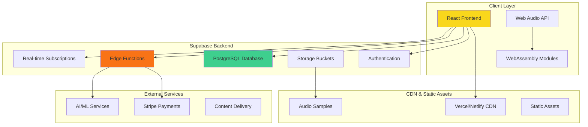

# Amapiano AI - System Architecture

## Overview

Amapiano AI is built as a modern, scalable web application using a React frontend with Supabase backend services. The architecture emphasizes real-time capabilities, cultural authenticity, and professional-grade audio processing.

## High-Level Architecture



## Frontend Architecture

### React Application Structure

```
src/
├── App.tsx                 # Main application component
├── main.tsx               # Application entry point
├── index.css              # Global styles & design system
│
├── components/            # Reusable components
│   ├── ui/               # shadcn/ui components
│   │   ├── button.tsx
│   │   ├── card.tsx
│   │   ├── dialog.tsx
│   │   └── ...
│   │
│   ├── daw/              # DAW-specific components
│   │   ├── OpenProjectModal.tsx
│   │   └── ProjectSettingsModal.tsx
│   │
│   ├── Navigation.tsx     # Main navigation
│   ├── OptimizedTimeline.tsx
│   ├── OptimizedMixer.tsx
│   ├── AudioRecordingPanel.tsx
│   ├── EnhancedFileUpload.tsx
│   └── ...
│
├── pages/                # Route components
│   ├── Index.tsx         # Landing page
│   ├── Auth.tsx          # Authentication
│   ├── Generate.tsx      # Music generation
│   ├── Analyze.tsx       # Audio analysis
│   ├── Samples.tsx       # Sample library
│   ├── Patterns.tsx      # Pattern library
│   ├── DAW.tsx           # Digital Audio Workstation
│   └── NotFound.tsx      # 404 page
│
├── hooks/                # Custom React hooks
│   ├── useAudioEngine.ts
│   ├── useAudioEffects.ts
│   ├── useDawProjects.ts
│   ├── useSubscription.ts
│   └── ...
│
├── integrations/         # External service integrations
│   └── supabase/
│       ├── client.ts
│       └── types.ts
│
├── types/                # TypeScript definitions
│   └── daw.ts
│
└── lib/                  # Utility functions
    └── utils.ts
```

### State Management Architecture

```typescript
// Global State Management
const App = () => {
  // Authentication state
  const [user, setUser] = useState<User | null>(null);
  const [session, setSession] = useState<Session | null>(null);
  
  // Supabase auth listener
  useEffect(() => {
    const { data: { subscription } } = supabase.auth.onAuthStateChange(
      (event, session) => {
        setSession(session);
        setUser(session?.user ?? null);
      }
    );
    return () => subscription.unsubscribe();
  }, []);

  return (
    <QueryClientProvider client={queryClient}>
      <TooltipProvider>
        <BrowserRouter>
          {/* App content */}
        </BrowserRouter>
      </TooltipProvider>
    </QueryClientProvider>
  );
};

// Feature-specific state with React Query
const useDawProjects = () => {
  return useQuery({
    queryKey: ['daw-projects'],
    queryFn: async () => {
      const { data } = await supabase
        .from('daw_projects')
        .select('*')
        .order('updated_at', { ascending: false });
      return data;
    }
  });
};
```

### Component Architecture Patterns

```typescript
// Compound Component Pattern for Complex UI
const Timeline = {
  Root: TimelineRoot,
  Track: TimelineTrack,
  Clip: TimelineClip,
  Playhead: TimelinePlayhead,
};

// Usage
<Timeline.Root>
  <Timeline.Playhead />
  {tracks.map(track => (
    <Timeline.Track key={track.id}>
      {track.clips.map(clip => (
        <Timeline.Clip key={clip.id} {...clip} />
      ))}
    </Timeline.Track>
  ))}
</Timeline.Root>

// Custom Hook Pattern for Feature Logic
const useAudioEngine = () => {
  const [context, setContext] = useState<AudioContext | null>(null);
  const [isPlaying, setIsPlaying] = useState(false);
  
  const play = useCallback(() => {
    // Audio playback logic
  }, [context]);
  
  const stop = useCallback(() => {
    // Audio stop logic
  }, [context]);
  
  return { context, isPlaying, play, stop };
};
```

## Backend Architecture (Supabase)

### Database Schema Design

```sql
-- Core authentication extends Supabase auth.users
CREATE TABLE public.profiles (
  id UUID NOT NULL DEFAULT gen_random_uuid() PRIMARY KEY,
  user_id UUID NOT NULL REFERENCES auth.users(id) ON DELETE CASCADE,
  display_name TEXT,
  avatar_url TEXT,
  created_at TIMESTAMPTZ NOT NULL DEFAULT now(),
  updated_at TIMESTAMPTZ NOT NULL DEFAULT now()
);

-- DAW project storage
CREATE TABLE public.daw_projects (
  id UUID NOT NULL DEFAULT gen_random_uuid() PRIMARY KEY,
  user_id UUID NOT NULL REFERENCES auth.users(id) ON DELETE CASCADE,
  name TEXT NOT NULL,
  version INTEGER NOT NULL DEFAULT 1,
  bpm INTEGER NOT NULL DEFAULT 120,
  key_signature TEXT NOT NULL DEFAULT 'C',
  time_signature TEXT NOT NULL DEFAULT '4/4',
  project_data JSONB NOT NULL DEFAULT '{}'::jsonb,
  created_at TIMESTAMPTZ NOT NULL DEFAULT now(),
  updated_at TIMESTAMPTZ NOT NULL DEFAULT now()
);

-- Subscription management
CREATE TABLE public.subscribers (
  id UUID NOT NULL DEFAULT gen_random_uuid() PRIMARY KEY,
  user_id UUID NOT NULL REFERENCES auth.users(id) ON DELETE CASCADE,
  email TEXT NOT NULL UNIQUE,
  stripe_customer_id TEXT,
  subscribed BOOLEAN NOT NULL DEFAULT false,
  subscription_tier TEXT,
  subscription_end TIMESTAMPTZ,
  created_at TIMESTAMPTZ NOT NULL DEFAULT now(),
  updated_at TIMESTAMPTZ NOT NULL DEFAULT now()
);

-- Marketplace items
CREATE TABLE public.marketplace_items (
  id UUID NOT NULL DEFAULT gen_random_uuid() PRIMARY KEY,
  name TEXT NOT NULL,
  description TEXT,
  category TEXT NOT NULL,
  subcategory TEXT,
  price_cents INTEGER NOT NULL,
  currency TEXT NOT NULL DEFAULT 'usd',
  rating DECIMAL(3,2) DEFAULT 0.00,
  downloads INTEGER DEFAULT 0,
  tags TEXT[] DEFAULT '{}',
  image_url TEXT,
  featured BOOLEAN DEFAULT false,
  active BOOLEAN DEFAULT true,
  created_at TIMESTAMPTZ NOT NULL DEFAULT now(),
  updated_at TIMESTAMPTZ NOT NULL DEFAULT now()
);

-- Sample library
CREATE TABLE public.samples (
  id UUID NOT NULL DEFAULT gen_random_uuid() PRIMARY KEY,
  user_id UUID REFERENCES auth.users(id) ON DELETE CASCADE,
  name TEXT NOT NULL,
  description TEXT,
  file_url TEXT NOT NULL,
  category TEXT NOT NULL,
  bpm INTEGER,
  key_signature TEXT,
  duration DECIMAL(10,3) NOT NULL,
  file_size INTEGER,
  tags TEXT[] DEFAULT '{}',
  is_public BOOLEAN DEFAULT false,
  created_at TIMESTAMPTZ NOT NULL DEFAULT now(),
  updated_at TIMESTAMPTZ NOT NULL DEFAULT now()
);
```

### Row Level Security (RLS) Policies

```sql
-- Enable RLS on all tables
ALTER TABLE public.profiles ENABLE ROW LEVEL SECURITY;
ALTER TABLE public.daw_projects ENABLE ROW LEVEL SECURITY;
ALTER TABLE public.subscribers ENABLE ROW LEVEL SECURITY;
ALTER TABLE public.samples ENABLE ROW LEVEL SECURITY;

-- User can only access their own data
CREATE POLICY "Users can view own profile" ON public.profiles
  FOR SELECT USING (auth.uid() = user_id);

CREATE POLICY "Users can update own profile" ON public.profiles
  FOR UPDATE USING (auth.uid() = user_id);

CREATE POLICY "Users can view own projects" ON public.daw_projects
  FOR SELECT USING (auth.uid() = user_id);

CREATE POLICY "Users can create own projects" ON public.daw_projects
  FOR INSERT WITH CHECK (auth.uid() = user_id);

-- Public access for marketplace
CREATE POLICY "Marketplace items are publicly readable" ON public.marketplace_items
  FOR SELECT USING (active = true);

-- Public samples are viewable by all
CREATE POLICY "Public samples are viewable" ON public.samples
  FOR SELECT USING (is_public = true OR auth.uid() = user_id);
```

### Edge Functions Architecture

```typescript
// Edge Function Structure
supabase/functions/
├── ai-music-generation/
│   └── index.ts          # Music generation endpoint
├── check-subscription/
│   └── index.ts          # Subscription verification
├── create-purchase/
│   └── index.ts          # One-time payment processing
├── create-subscription/
│   └── index.ts          # Subscription creation
├── customer-portal/
│   └── index.ts          # Stripe billing portal
└── demo-audio-files/
    └── index.ts          # Demo file generation

// Edge Function Pattern
import { serve } from "https://deno.land/std@0.190.0/http/server.ts";
import { createClient } from "https://esm.sh/@supabase/supabase-js@2.45.0";

const corsHeaders = {
  'Access-Control-Allow-Origin': '*',
  'Access-Control-Allow-Headers': 'authorization, x-client-info, apikey, content-type',
};

serve(async (req) => {
  // Handle CORS
  if (req.method === 'OPTIONS') {
    return new Response(null, { headers: corsHeaders });
  }

  try {
    // Authentication
    const supabaseClient = createClient(
      Deno.env.get('SUPABASE_URL') ?? '',
      Deno.env.get('SUPABASE_SERVICE_ROLE_KEY') ?? ''
    );

    const authHeader = req.headers.get('Authorization')!;
    const token = authHeader.replace('Bearer ', '');
    const { data } = await supabaseClient.auth.getUser(token);
    
    // Business logic
    // ...

    return new Response(JSON.stringify(result), {
      headers: { ...corsHeaders, 'Content-Type': 'application/json' }
    });
  } catch (error) {
    return new Response(JSON.stringify({ error: error.message }), {
      headers: { ...corsHeaders, 'Content-Type': 'application/json' },
      status: 500
    });
  }
});
```

## Audio Processing Architecture

### Web Audio API Integration

```typescript
// Audio Engine Architecture
class AudioEngine {
  private context: AudioContext;
  private masterGain: GainNode;
  private tracks: Map<string, AudioTrack> = new Map();

  constructor() {
    this.context = new (window.AudioContext || window.webkitAudioContext)();
    this.masterGain = this.context.createGain();
    this.masterGain.connect(this.context.destination);
  }

  createTrack(id: string): AudioTrack {
    const track = new AudioTrack(this.context, this.masterGain);
    this.tracks.set(id, track);
    return track;
  }

  play(): void {
    this.context.resume();
    this.tracks.forEach(track => track.play());
  }

  stop(): void {
    this.tracks.forEach(track => track.stop());
  }
}

// Audio Track Implementation
class AudioTrack {
  private context: AudioContext;
  private gainNode: GainNode;
  private panNode: StereoPannerNode;
  private bufferSource: AudioBufferSourceNode | null = null;

  constructor(context: AudioContext, destination: AudioNode) {
    this.context = context;
    this.gainNode = context.createGain();
    this.panNode = context.createStereoPanner();
    
    this.gainNode.connect(this.panNode);
    this.panNode.connect(destination);
  }

  loadAudio(audioBuffer: AudioBuffer): void {
    this.bufferSource = this.context.createBufferSource();
    this.bufferSource.buffer = audioBuffer;
    this.bufferSource.connect(this.gainNode);
  }

  play(): void {
    if (this.bufferSource) {
      this.bufferSource.start();
    }
  }
}
```

### Real-time Audio Processing

```typescript
// WebAssembly integration for intensive processing
const initWasm = async () => {
  const wasmModule = await import('./audio-processor.wasm');
  return wasmModule;
};

// Audio worklet for real-time processing
class AudioProcessor extends AudioWorkletProcessor {
  process(inputs: Float32Array[][], outputs: Float32Array[][]) {
    const input = inputs[0];
    const output = outputs[0];
    
    // Real-time audio processing
    for (let channel = 0; channel < output.length; channel++) {
      const inputChannel = input[channel];
      const outputChannel = output[channel];
      
      for (let i = 0; i < inputChannel.length; i++) {
        // Apply processing (filters, effects, etc.)
        outputChannel[i] = this.processAudioSample(inputChannel[i]);
      }
    }
    
    return true;
  }
  
  private processAudioSample(sample: number): number {
    // Audio processing logic
    return sample;
  }
}

registerProcessor('audio-processor', AudioProcessor);
```

## Data Flow Architecture

### Client-Server Communication

```typescript
// Data flow pattern using React Query
const useGenerateMusic = () => {
  return useMutation({
    mutationFn: async (params: GenerationParams) => {
      const { data } = await supabase.functions.invoke('ai-music-generation', {
        body: params
      });
      return data;
    },
    onSuccess: (data) => {
      // Update UI with generated music
      queryClient.invalidateQueries(['generated-music']);
    },
    onError: (error) => {
      toast({
        title: "Generation Failed",
        description: error.message,
        variant: "destructive"
      });
    }
  });
};

// Real-time updates using Supabase subscriptions
const useRealtimeProjects = (userId: string) => {
  const [projects, setProjects] = useState<DawProject[]>([]);

  useEffect(() => {
    const subscription = supabase
      .channel('daw_projects')
      .on('postgres_changes', {
        event: '*',
        schema: 'public',
        table: 'daw_projects',
        filter: `user_id=eq.${userId}`
      }, (payload) => {
        // Handle real-time updates
        setProjects(prev => updateProjectsFromPayload(prev, payload));
      })
      .subscribe();

    return () => {
      subscription.unsubscribe();
    };
  }, [userId]);

  return projects;
};
```

## Security Architecture

### Authentication & Authorization

```typescript
// Supabase Auth integration
const useAuth = () => {
  const [user, setUser] = useState<User | null>(null);

  useEffect(() => {
    const { data: { subscription } } = supabase.auth.onAuthStateChange(
      async (event, session) => {
        if (session) {
          setUser(session.user);
          // Check subscription status
          await supabase.functions.invoke('check-subscription');
        } else {
          setUser(null);
        }
      }
    );

    return () => subscription.unsubscribe();
  }, []);

  return {
    user,
    signIn: (credentials: SignInCredentials) => supabase.auth.signInWithPassword(credentials),
    signUp: (credentials: SignUpCredentials) => supabase.auth.signUp(credentials),
    signOut: () => supabase.auth.signOut()
  };
};

// Feature-based access control
const FeatureGate: React.FC<FeatureGateProps> = ({
  feature,
  requiredTier,
  children
}) => {
  const { subscription } = useSubscription();
  
  if (hasAccess(subscription.tier, requiredTier)) {
    return <>{children}</>;
  }
  
  return <UpgradePrompt feature={feature} requiredTier={requiredTier} />;
};
```

### Content Security Policy

```typescript
// Security headers in edge functions
const securityHeaders = {
  'Content-Security-Policy': "default-src 'self'; script-src 'self' 'unsafe-eval'; style-src 'self' 'unsafe-inline';",
  'X-Frame-Options': 'DENY',
  'X-Content-Type-Options': 'nosniff',
  'Referrer-Policy': 'strict-origin-when-cross-origin'
};
```

## Performance Architecture

### Optimization Strategies

```typescript
// Code splitting by route
const Generate = lazy(() => import('./pages/Generate'));
const Analyze = lazy(() => import('./pages/Analyze'));
const DAW = lazy(() => import('./pages/DAW'));

// Component optimization
const ExpensiveComponent = React.memo(({ data }) => {
  const processedData = useMemo(() => 
    expensiveCalculation(data), [data]
  );
  
  return <div>{processedData}</div>;
});

// Virtual scrolling for large lists
import { FixedSizeList as List } from 'react-window';

const SampleList = ({ samples }) => (
  <List
    height={600}
    itemCount={samples.length}
    itemSize={80}
    itemData={samples}
  >
    {SampleItem}
  </List>
);
```

### Caching Strategy

```typescript
// React Query cache configuration
const queryClient = new QueryClient({
  defaultOptions: {
    queries: {
      staleTime: 1000 * 60 * 5, // 5 minutes
      cacheTime: 1000 * 60 * 10, // 10 minutes
      refetchOnWindowFocus: false,
    },
  },
});

// Service worker for static asset caching
if ('serviceWorker' in navigator) {
  navigator.serviceWorker.register('/sw.js');
}
```

## Deployment Architecture

### Build & Deployment Pipeline

```typescript
// Vite configuration
export default defineConfig({
  plugins: [react(), componentTagger()],
  build: {
    rollupOptions: {
      output: {
        manualChunks: {
          vendor: ['react', 'react-dom'],
          ui: ['@radix-ui/react-dialog', '@radix-ui/react-dropdown-menu'],
          audio: ['web-audio-api-helpers']
        }
      }
    }
  },
  resolve: {
    alias: {
      '@': path.resolve(__dirname, './src')
    }
  }
});
```

### Environment Configuration

```bash
# Production environment variables
VITE_SUPABASE_URL=https://mywijmtszelyutssormy.supabase.co
VITE_SUPABASE_ANON_KEY=eyJhbGciOiJIUzI1NiIs...

# Edge function secrets (managed via Supabase dashboard)
STRIPE_SECRET_KEY=sk_live_...
OPENAI_API_KEY=sk-...
```

## Monitoring & Analytics

### Error Tracking & Performance Monitoring

```typescript
// Error boundary implementation
class ErrorBoundary extends React.Component {
  componentDidCatch(error: Error, errorInfo: ErrorInfo) {
    // Log to monitoring service
    console.error('Application error:', error, errorInfo);
    
    // Track in analytics
    if (window.gtag) {
      window.gtag('event', 'exception', {
        description: error.message,
        fatal: false
      });
    }
  }
}

// Performance monitoring
const usePerformanceMonitoring = () => {
  useEffect(() => {
    // Track Core Web Vitals
    import('web-vitals').then(({ getLCP, getFID, getCLS }) => {
      getLCP(console.log);
      getFID(console.log);
      getCLS(console.log);
    });
  }, []);
};
```

---

This architecture provides a solid foundation for building a professional, scalable, and culturally authentic amapiano music creation platform while maintaining high performance and security standards.